#########
XenCenter
#########

============================
Creating MCAT Virtual Server
============================

.. image:: ../images/mcat/xenserver_001.png
    :scale: 50 %
    
* インフラストラクチャ欄 テンプレート> 右クリック > 新規VMウィザード

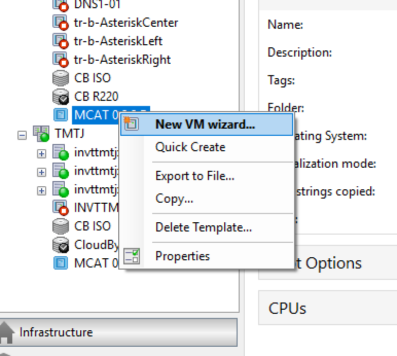
    
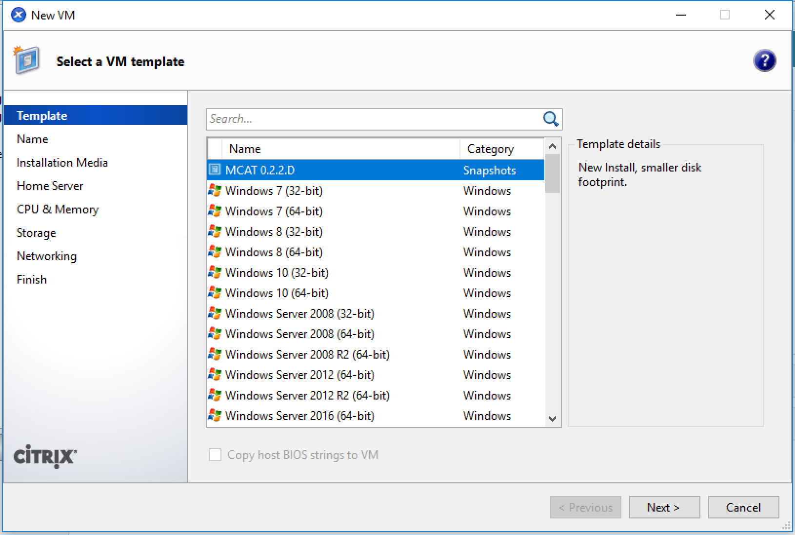

* テンプレート MCAT 0.2.2.D (最新のスナップショット)を選択したまま 次へ

    
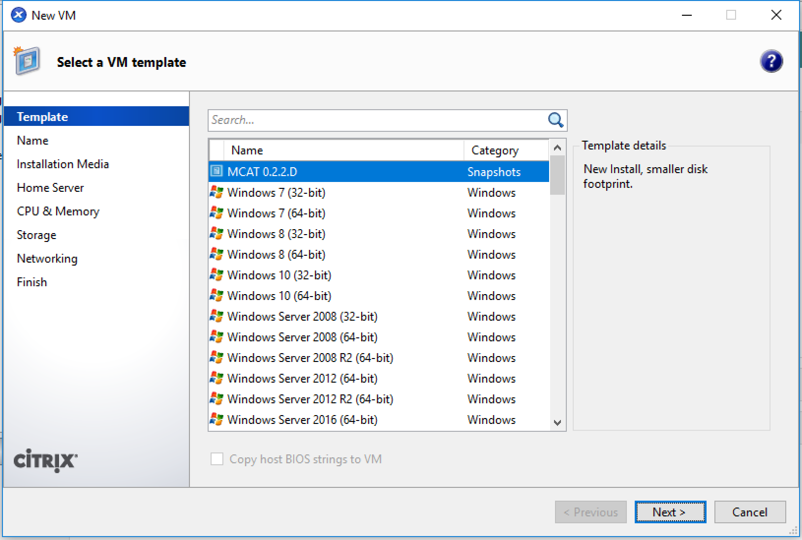
    
* 名前 大文字で 説明 いれる

    
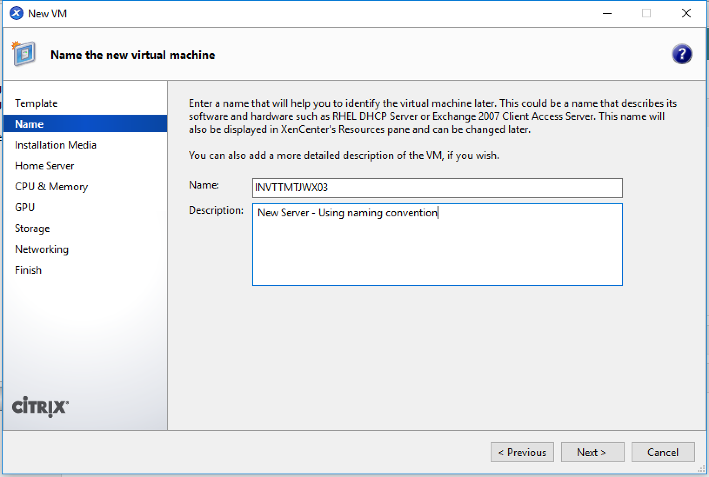

* インストールメディア なし 次へ

    
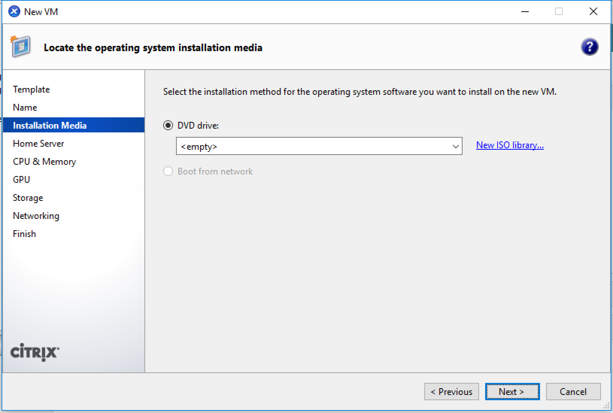

* ホームサーバー 指定しない
    
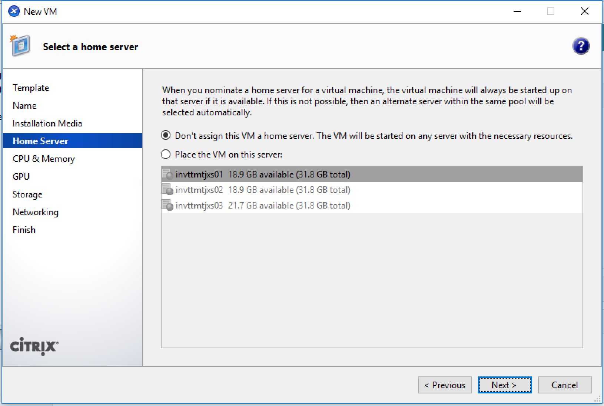

* CPUとメモリ 2 2S1C 512MB/1024MB 次へ
    
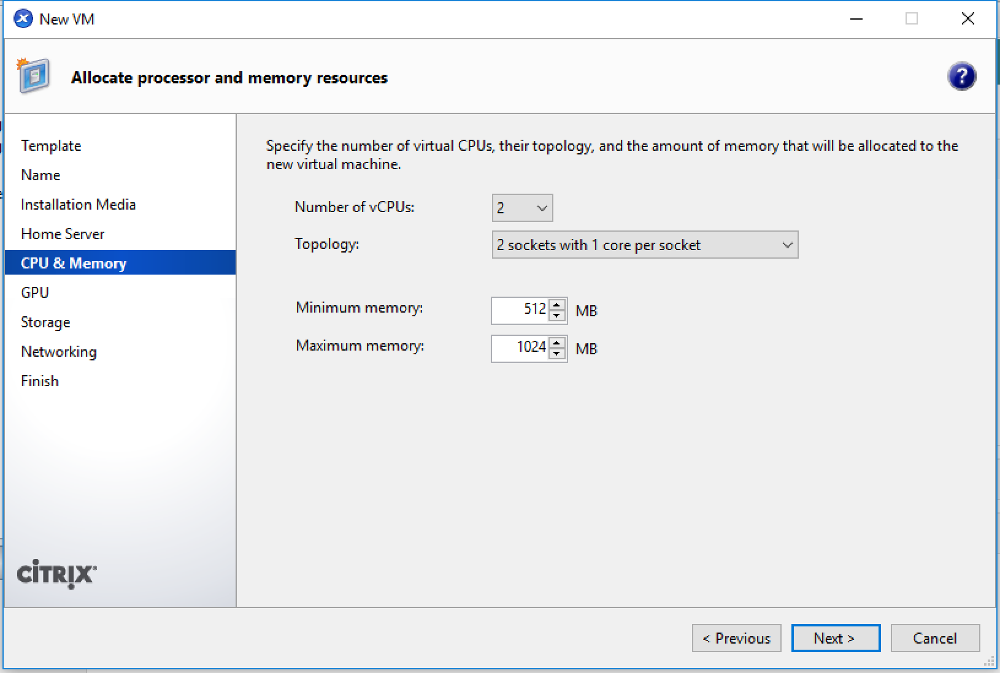

* GPU 次へ
    
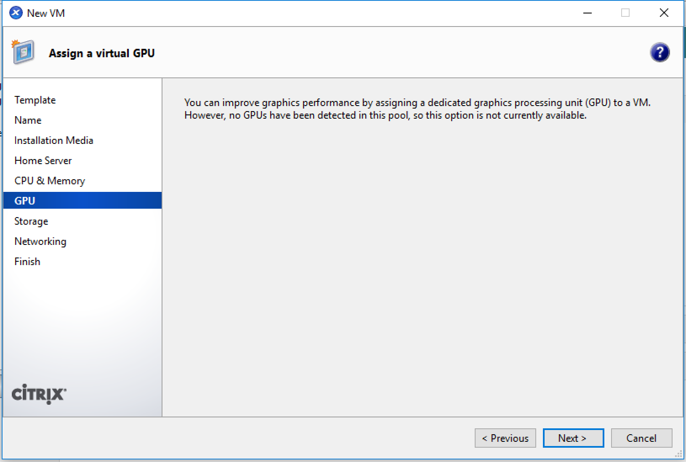

* ストレージ CloudByte ``CB`` 次へ

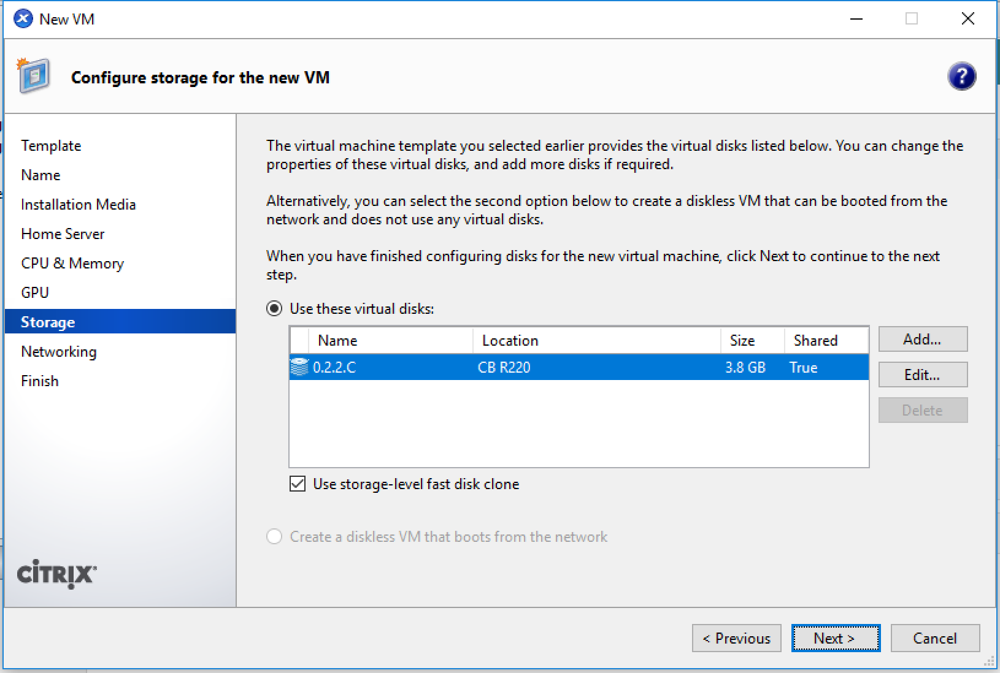
    
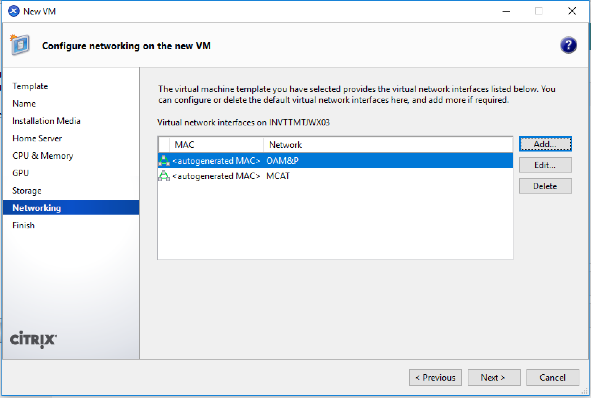
    
* ネットワーク eth2 を足す VLAN調整 OpenSwan等 次へ

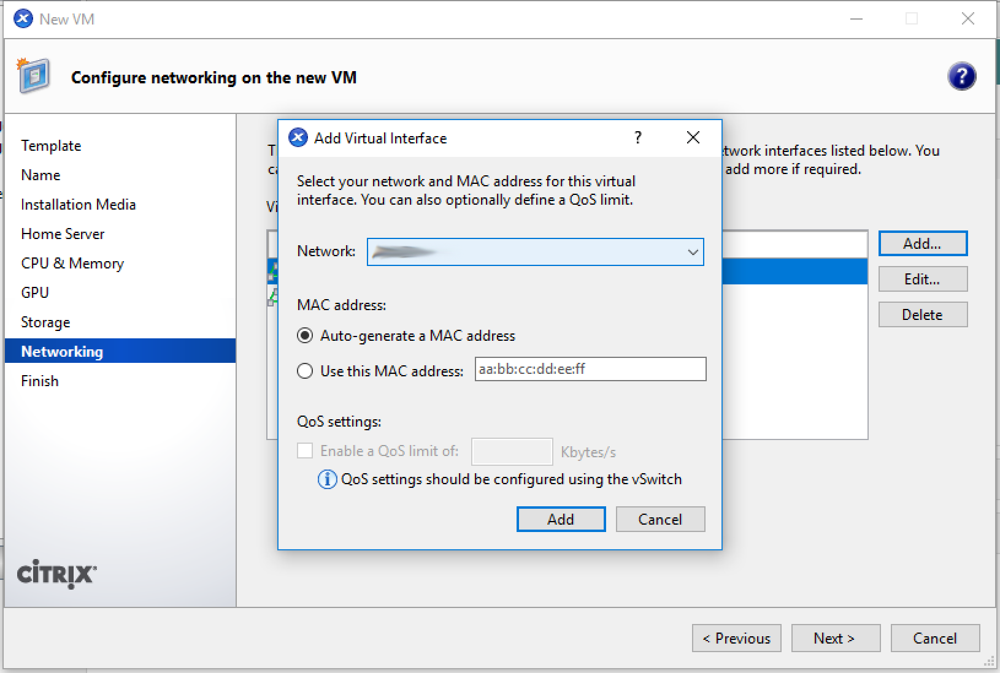
    
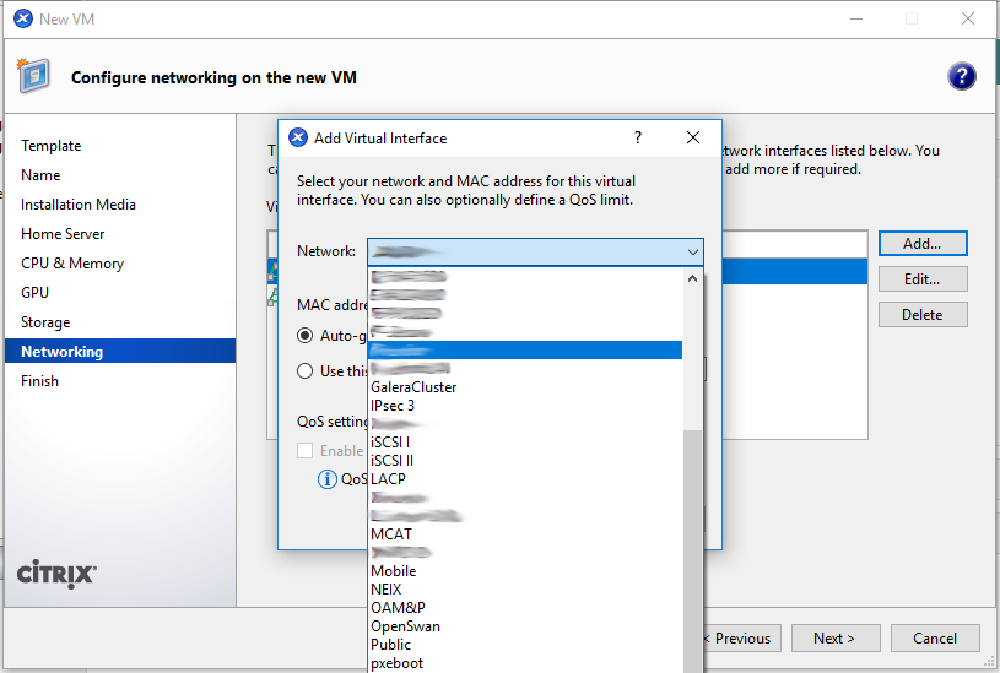
    
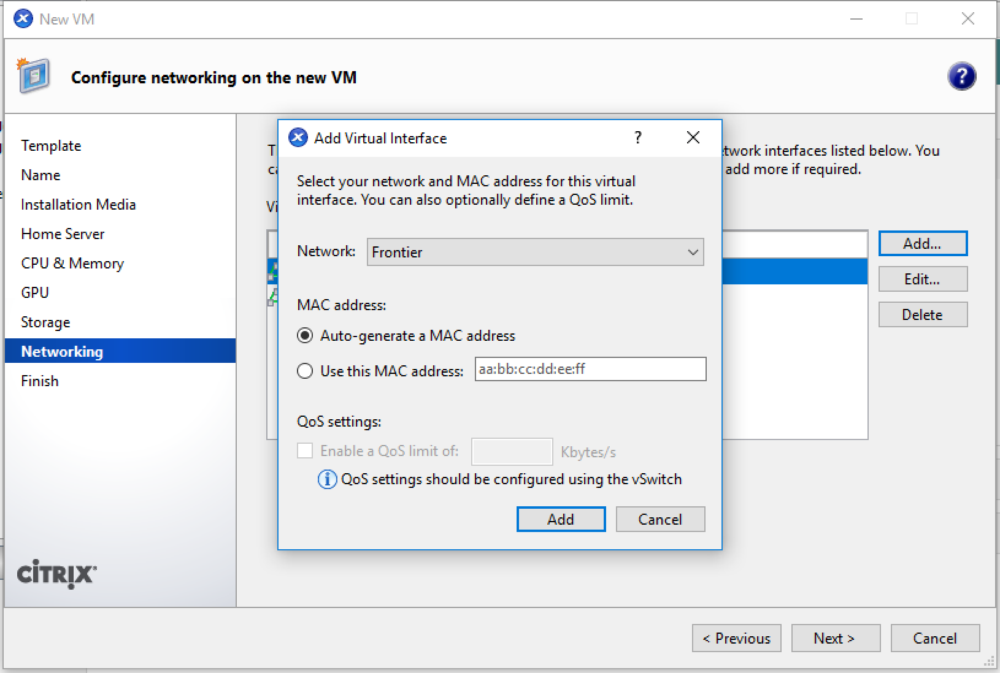
    
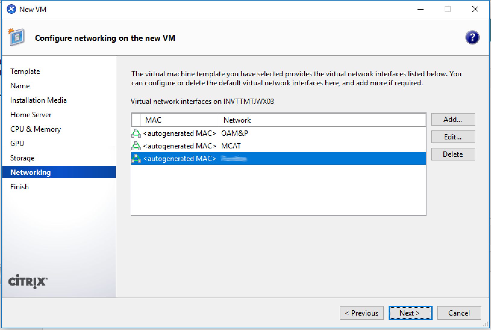
    
自動的に起動しない（チェックボックスをオフにする）
*あなたが調整したい場合はオプションです。*
    
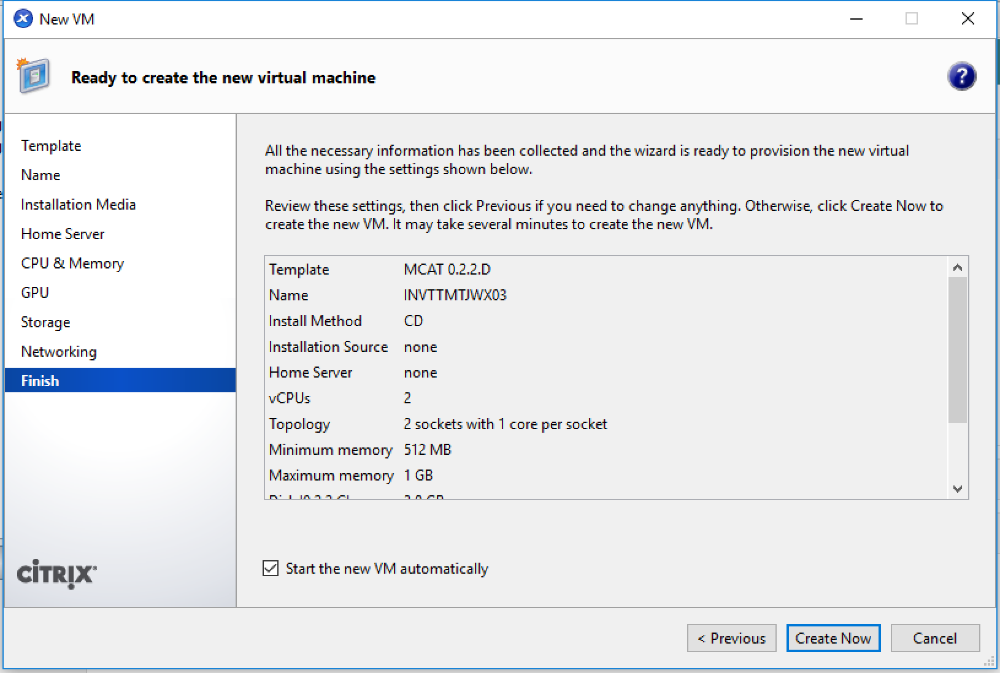
    
* 完了 作成

* サーチして、右クリック VMのコピー 名前変更 コピーモードを完全コピーを選択しクラウドバイトに コピー
