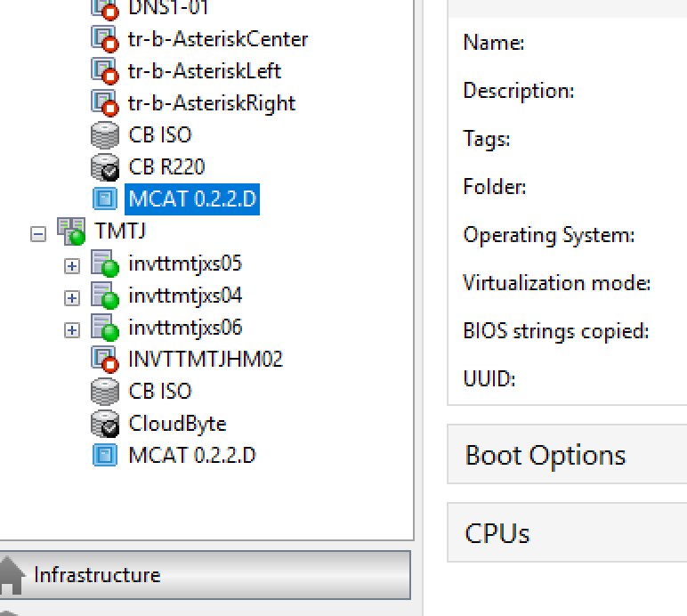
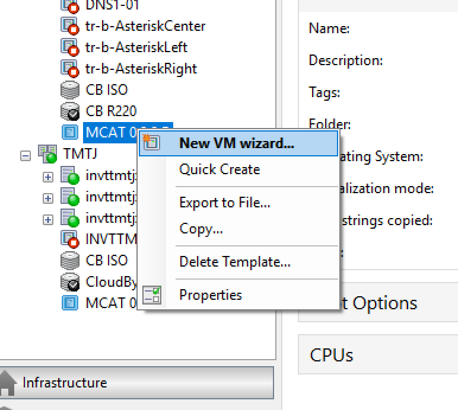
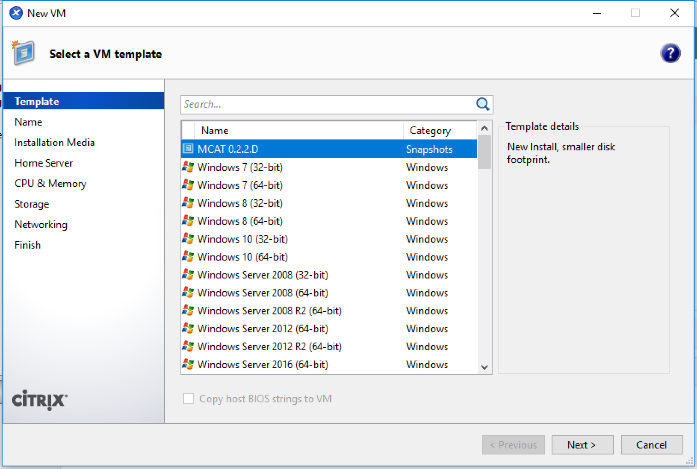
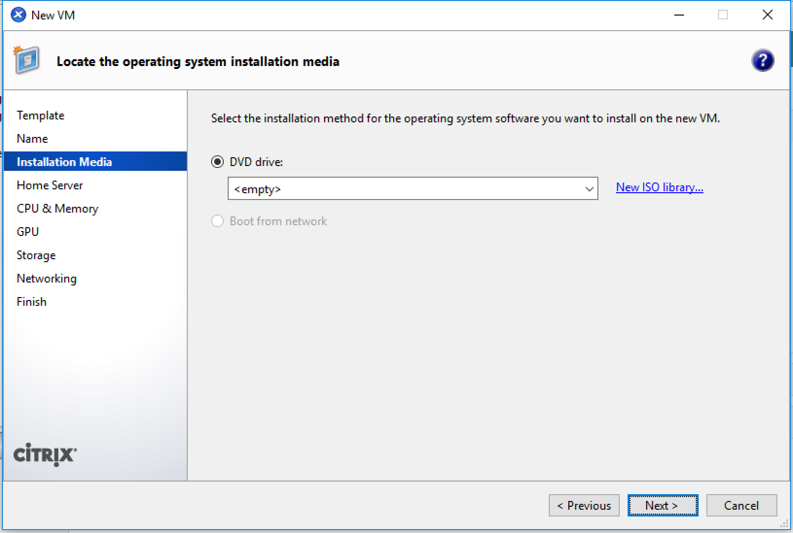
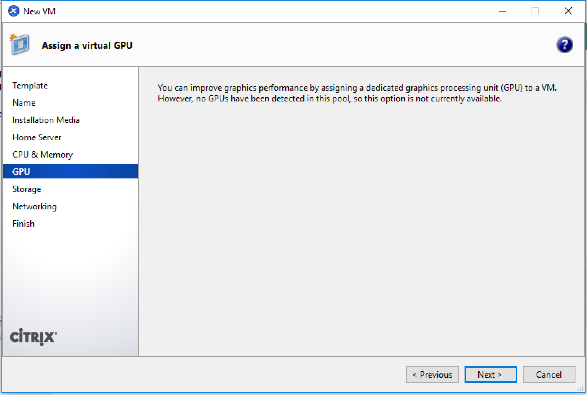
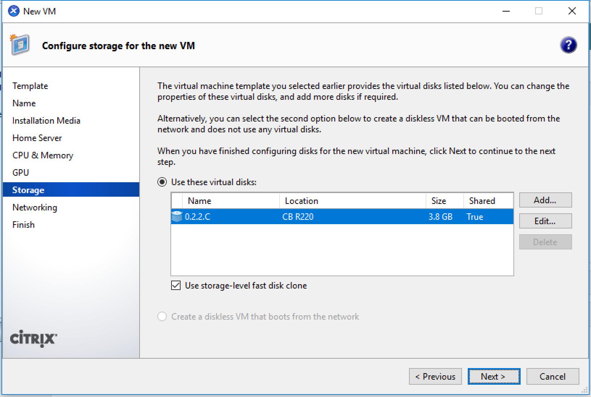
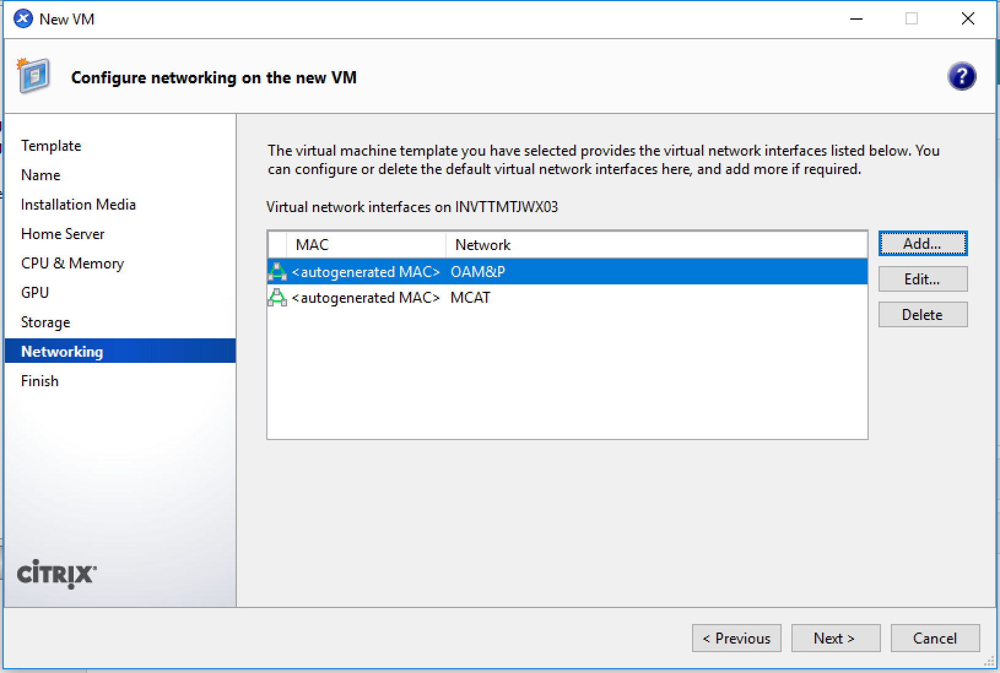
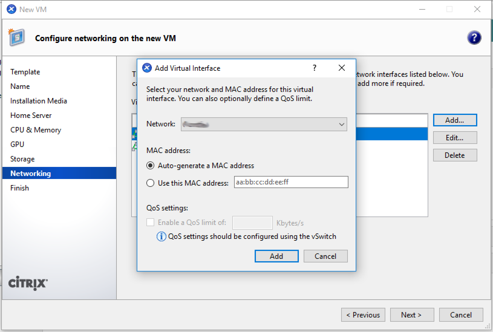

#########
XenCenter
#########

Creating a new MCAT virtual machine.
====================================

Find the *latest* MCAT template.
--------------------------------

    
Right Click and Select **New VM wizard...**
--------------------------------------------

    

    
.. image:: images/mcat/xenserver_004.png
    :scale: 50 %
    
.. image:: images/mcat/xenserver_005.png
    :scale: 50 %
    
Set the **Name** of the MCAT virtual machine.
---------------------------------------------
    

    
.. image:: images/mcat/xenserver_007.png
    :scale: 50 %
    
.. image:: images/mcat/xenserver_008.png
    :scale: 50 %
    

    

    
Add any network interfaces necessary.
-------------------------------------

.. image:: images/mcat/xenserver_012.png
    :scale: 50 %
    
.. image:: images/mcat/xenserver_013.png
    :scale: 50 %
    

    
.. image:: images/mcat/xenserver_015.png
    :scale: 50 %
    
.. image:: images/mcat/xenserver_016.png
    :scale: 50 %